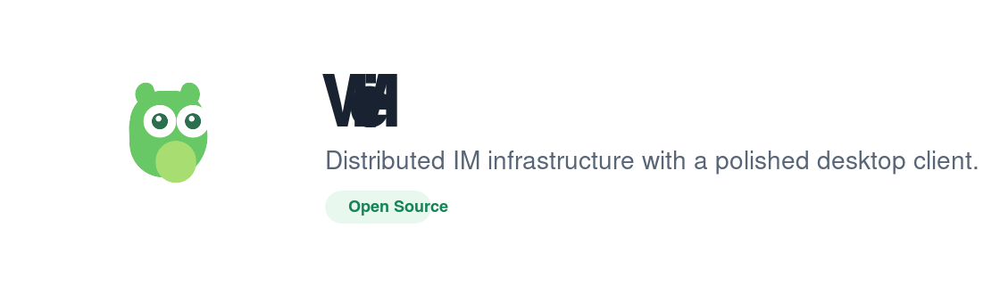

<p align="center">
  
</p>

<h1 align="center">WeHi</h1>

<p align="center">
  A polished distributed IM project with a desktop-style web client, dedicated auth/API/realtime services, and a clean container delivery workflow.
</p>

<p align="center">
  <a href="https://github.com/LeeJc02/WeHi/actions/workflows/ci.yml"></a>
  <a href="https://github.com/LeeJc02/WeHi/actions/workflows/release-images.yml"></a>
  <a href="https://github.com/LeeJc02/WeHi/blob/main/LICENSE"></a>
  <a href="https://github.com/LeeJc02/WeHi/pkgs/container/wehi%2Fauth-service"></a>
  <a href="https://github.com/LeeJc02/WeHi/stargazers"></a>
</p>

<p align="center">
  <a href="./README.zh-CN.md">中文说明</a>
</p>

## Overview

WeHi is a full-stack messaging system built around a realistic realtime workflow instead of a single CRUD demo. The repository ships a desktop-style Next.js client, a Go backend split into focused services, and a release path that can be pulled directly from GHCR on both `linux/amd64` and `linux/arm64`.

This project focuses on the parts that make messaging systems interesting:

- token-based authentication and multi-session management
- WebSocket connectivity, heartbeats, and online presence
- direct chat, group chat, message recall, read receipts
- incremental resync after reconnects with `sync_events + cursor`
- containerized local development and GHCR-based release delivery

If this repository helps or gives you ideas for your own messaging stack, consider giving it a star.

## Highlights

- **Service boundaries that make sense**: auth, business API, and realtime gateway are split into dedicated processes.
- **Clear state layering**: MySQL stores durable facts while Redis carries high-frequency state such as sessions and presence.
- **Replayable sync model**: reconnects are handled through an incremental event log instead of relying on best-effort realtime delivery only.
- **Production-shaped developer experience**: CI, smoke checks, health probes, tracing, and prebuilt release images are all included.
- **Polished frontend**: the client keeps a familiar desktop IM flow while using a more refined visual system and a branded login experience.

## Architecture

### Services

- `auth-service`: registration, login, refresh token rotation, session lifecycle
- `api-service`: users, friendships, conversations, messages, uploads, search, admin APIs
- `realtime-service`: WebSocket connections, heartbeat management, realtime fan-out, presence updates

### Data and state

- `MySQL`: users, friendships, conversations, messages, sync events, admin data
- `Redis`: session cache, presence data, and high-frequency runtime state
- `sync_events`: user-scoped incremental event log for catch-up after reconnects

### Frontend

- `frontend/` hosts a Next.js App Router client with a desktop-style shell, chat store, auth context, and realtime hooks
- the UI is intentionally closer to a shipping IM product than a raw demo page

## Tech Stack

| Layer | Stack |
| --- | --- |
| Backend | Go, Gin, GORM |
| Frontend | Next.js 16, React 19, TypeScript, Tailwind CSS |
| Data | MySQL, Redis |
| Realtime | WebSocket |
| Observability | OpenTelemetry, Jaeger |
| Delivery | Docker, GitHub Actions, GHCR |

## Repository Layout

```text
.
├── assets/brand/      # project logo and branding assets
├── backend/           # Go services, config, migrations, contracts
├── deploy/compose/    # local runtime and GHCR release compose files
├── frontend/          # Next.js client
├── scripts/           # compose helpers, smoke scripts, runtime helpers
└── .github/workflows/ # CI and image publishing pipelines
```

## Local Development

Start the local stack:

```bash
make start
```

Run the smoke checks:

```bash
make smoke
```

Stop the environment:

```bash
make stop
```

Default endpoints:

- Frontend: `http://127.0.0.1:25173`
- Auth: `http://127.0.0.1:28081`
- API: `http://127.0.0.1:28082`
- Realtime: `ws://127.0.0.1:28083/ws`
- Jaeger: `http://127.0.0.1:28686`

## Run from GHCR

WeHi publishes multi-arch release images to GHCR, so another machine can run the stack without installing Go or Node locally.

```bash
export IMAGE_PREFIX=ghcr.io/leejc02/wehi
export IMAGE_TAG=latest
make release-up
```

Stop the release stack:

```bash
make release-down
```

Or use Docker Compose directly:

```bash
export IMAGE_PREFIX=ghcr.io/leejc02/wehi
export IMAGE_TAG=latest
docker compose -f deploy/compose/docker-compose.release.yml pull
docker compose -f deploy/compose/docker-compose.release.yml up -d --wait
```

Published images:

- `ghcr.io/leejc02/wehi/migrate`
- `ghcr.io/leejc02/wehi/auth-service`
- `ghcr.io/leejc02/wehi/api-service`
- `ghcr.io/leejc02/wehi/realtime-service`
- `ghcr.io/leejc02/wehi/frontend`

## Verification

```bash
make go-test
make frontend-lint
make frontend-build
make verify
```

## Roadmap

- improve richer group-management workflows
- add more release and deployment examples
- continue hardening the realtime sync and observability story

## Contributing

Issues, ideas, design suggestions, and pull requests are welcome. If you build on top of WeHi, I would love to see it.

## License

This project is released under the [MIT License](./LICENSE).
