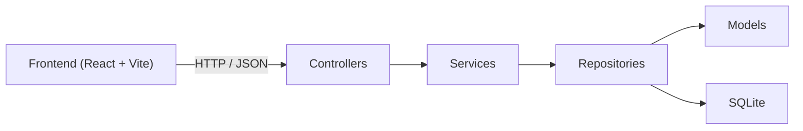

# Chat Workspace

这是一次重新整理后的前后端分离项目。

当前仓库已经从之前混杂的单体 / 分布式实验骨架，收敛成两个明确边界：

- `backend/`
  一个基于 Gin + GORM + SQLite 的 MVC REST API
- `frontend/`
  一个基于 React + Vite 的界面工作台

我已经删除了旧的分布式试验性目录、Docker/Kubernetes 部署物、遗留脚本、二进制文件和运行时产物，只保留现在真正需要维护的代码。

## 目录

```text
.
├── backend/        # Go MVC backend
├── frontend/       # React frontend
├── .gitignore
├── .ignore
└── Makefile
```

## 新架构



### Backend MVC 分层

```text
backend/
├── cmd/api/                    # 启动入口
├── internal/config/            # 配置
├── internal/database/          # 数据库初始化
├── internal/models/            # Model
├── internal/repositories/      # Repository
├── internal/services/          # Service
├── internal/controllers/       # Controller
├── internal/middleware/        # 鉴权中间件
├── internal/routes/            # 路由装配
└── internal/docs/openapi.yaml  # OpenAPI 文档
```

### Frontend 页面结构

```text
frontend/src/
├── api.ts        # 前端 API client
├── types.ts      # 类型定义
├── App.tsx       # 主工作台页面
├── App.css       # 页面视觉层
└── index.css
```

## Backend 能力

当前 REST API 已实现：

- 注册
- 登录
- 当前用户
- 用户列表
- 添加好友
- 好友列表
- 创建 / 复用单聊
- 创建群聊
- 会话列表
- 历史消息
- 发送消息
- 标记已读
- OpenAPI 文档下载

OpenAPI 文档：

- [backend/internal/docs/openapi.yaml](/Users/lee/GolandProjects/awesomeProject/10/backend/internal/docs/openapi.yaml)

后端健康检查：

- `GET /health`

OpenAPI 下载：

- `GET /openapi.yaml`

## Frontend 页面

前端不是占位页，而是直接围绕后端接口设计的一块工作台，包含：

- 登录 / 注册面板
- 用户目录
- 好友列表
- 群聊创建区域
- 会话列表
- 聊天消息区
- 消息发送器

视觉方向采用暖色磨砂卡片 + 深青色行动按钮，不走默认白底紫色模板。

## 本地运行

### 1. 启动后端

```bash
make backend-run
```

默认监听：

- `http://127.0.0.1:8081`

### 2. 安装前端依赖

```bash
make frontend-install
```

### 3. 启动前端

```bash
make frontend-dev
```

默认监听：

- `http://127.0.0.1:5173`

如果要改前端 API 地址，可设置：

```bash
cp frontend/.env.example frontend/.env
```

然后调整：

```env
VITE_API_BASE_URL=http://127.0.0.1:8081
```

## 接口文档

后端同时暴露：

- 在线文档源：`http://127.0.0.1:8081/openapi.yaml`
- 文件路径：[backend/internal/docs/openapi.yaml](/Users/lee/GolandProjects/awesomeProject/10/backend/internal/docs/openapi.yaml)

## 测试

### Backend

```bash
make backend-test
```

### Frontend 构建与 lint

```bash
make frontend-lint
make frontend-build
```

### 前端视角接口 smoke test

这个脚本使用前端同样的接口调用路径去验证后端：

- [frontend/scripts/api-smoke.mjs](/Users/lee/GolandProjects/awesomeProject/10/frontend/scripts/api-smoke.mjs)

执行：

```bash
make frontend-smoke
```

## 已完成的清理

这次已经移除了这些不再需要的内容：

- 旧的 `cmd/`、`internal/`、`configs/`、`deploy/`、`docs/`
- 旧的 gRPC / Kafka / Redis / WebSocket 试验性骨架
- Docker / Kubernetes 相关文件
- 遗留 `legacy/`
- 根目录 Go module
- 已跟踪的 `worker` 二进制
- 本地运行目录和虚拟环境

## Git 清理结论

我已经检查并清理过当前 Git：

- 旧仓库里确实提交过不该入库的二进制：`worker`
- 旧的分布式试验代码、部署物和运行产物已经全部从当前版本中移除
- `.gitignore` / `.ignore` 已补齐，防止产物再次进入版本控制
- 本地 Git 历史已经重写为新的干净根提交，不再保留旧的脏提交链

## 下一步建议

如果继续往下做，最值钱的是这三项：

1. 给后端补分页、搜索和更完整的 DTO / ViewModel。
2. 给前端补路由拆页、状态管理和更细的错误态。
3. 基于 OpenAPI 自动生成前端类型和 API client，减少手写接口漂移。
