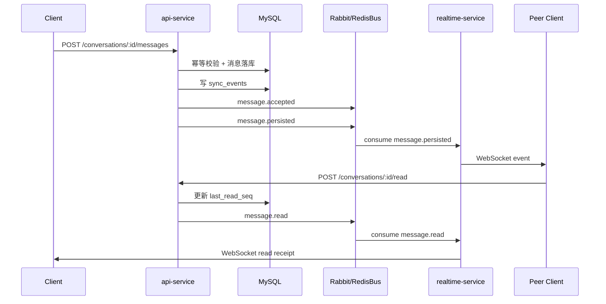
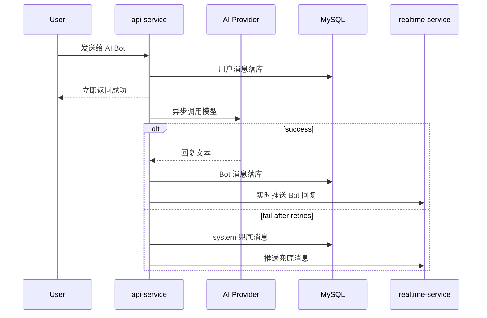
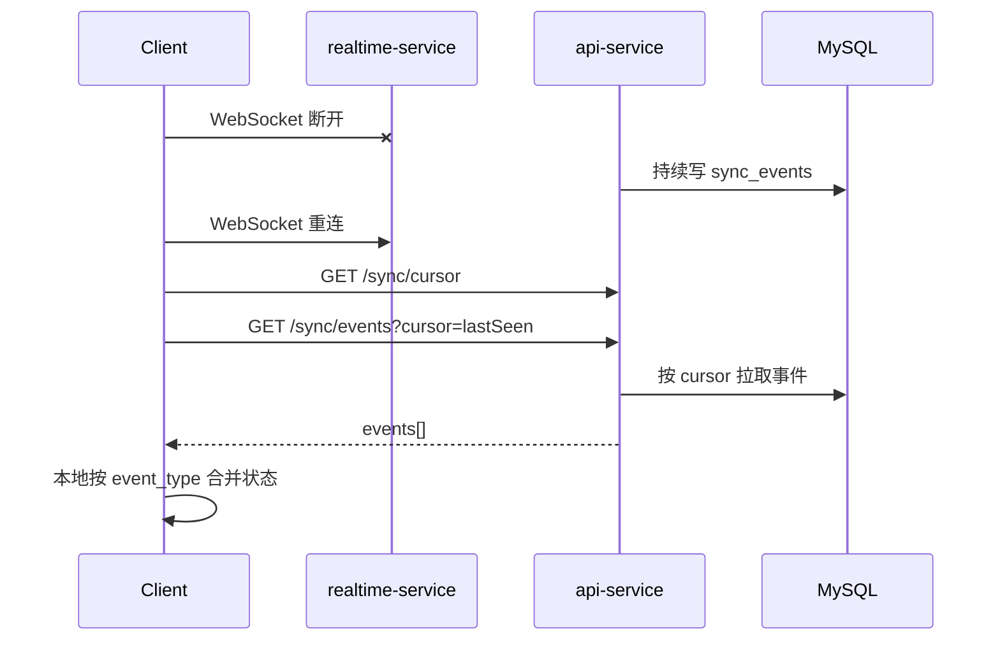

# 关键时序

## 普通消息发送

```mermaid
sequenceDiagram
    participant Client as Client
    participant API as api-service
    participant DB as MySQL
    participant MQ as Rabbit/RedisBus
    participant RT as realtime-service
    participant Peer as Peer Client

    Client->>API: POST /conversations/:id/messages
    API->>DB: 幂等校验 + 消息落库
    API->>DB: 写 sync_events
    API->>MQ: message.accepted
    API->>MQ: message.persisted
    MQ->>RT: consume message.persisted
    RT->>Peer: WebSocket event
    Peer->>API: POST /conversations/:id/read
    API->>DB: 更新 last_read_seq
    API->>MQ: message.read
    MQ->>RT: consume message.read
    RT->>Client: WebSocket read receipt
```

## AI Bot 异步回复

```mermaid
sequenceDiagram
    participant User as User
    participant API as api-service
    participant AI as AI Provider
    participant DB as MySQL
    participant RT as realtime-service

    User->>API: 发送给 AI Bot
    API->>DB: 用户消息落库
    API-->>User: 立即返回成功
    API->>AI: 异步调用模型
    alt success
        AI-->>API: 回复文本
        API->>DB: Bot 消息落库
        API->>RT: 实时推送 Bot 回复
    else fail after retries
        API->>DB: system 兜底消息
        API->>RT: 推送兜底消息
    end
```

## 断线补偿

```mermaid
sequenceDiagram
    participant Client as Client
    participant RT as realtime-service
    participant API as api-service
    participant DB as MySQL

    Client-xRT: WebSocket 断开
    API->>DB: 持续写 sync_events
    Client->>RT: WebSocket 重连
    Client->>API: GET /sync/cursor
    Client->>API: GET /sync/events?cursor=lastSeen
    API->>DB: 按 cursor 拉取事件
    API-->>Client: events[]
    Client->>Client: 本地按 event_type 合并状态
```
